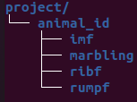

# USTool

## About this project

This project is intended to interface ALoka old ultrasound device. Furthermore, this tool allows the user to capture images and automatically segment Rib-eye area using deep learning with Tensorflow/Keras. 

This repository  is now deprecated. The project is now maintained at [ultraisom repository](https://github.com/edu010101/ultraisom)

## Prerequisite

- Tensorflow with Keras.
- Python 3.8.16.

## Usage

- Install the required packages:

```bash
python -m pip install -r requirements.txt
```

- Run the app:


```bash
python main_ui.py
```


## Folder and subfolders structure

The project main folder contains a XML file that defines the files location and project information. There are also some folders for storing the images collected during use of this tool. The folder structure is shown below.

